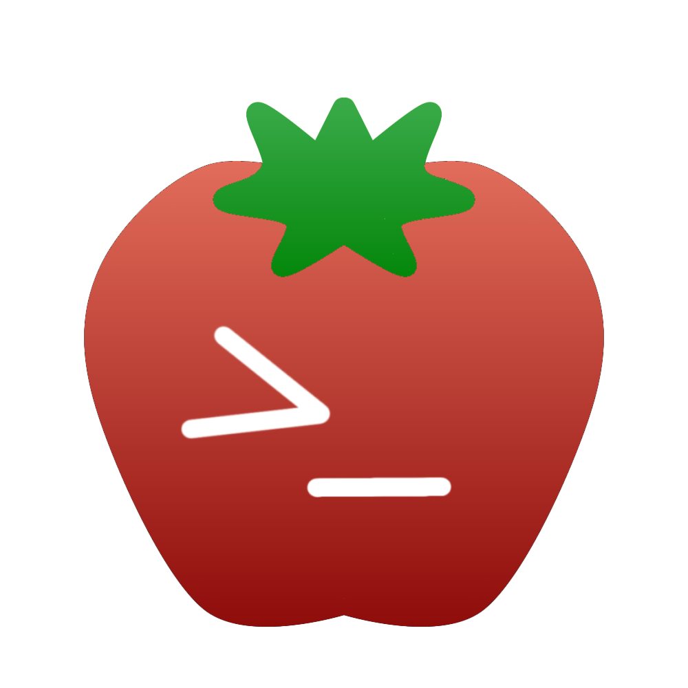
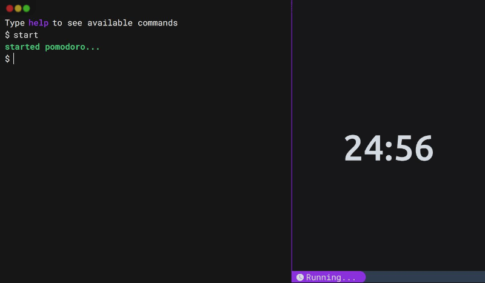

<a href="top"></a>

<br />
<div align="center">
  <a href="https://github.com/orodrigojose/pomotext">
    
  </a>

<h1 align="center">PomoText</h1>

  <p align="center">
    Simple pomodoro like terminal
    <br />
    <a href="https://pomotext.netlify.app/">
      <strong>Demo of Project »</strong>
    </a>
    <br /> <br />
    <a href="">
      
    </a>
    <a href="">
      
    </a>
  </p>
</div>

<div align="center">
  
</div>

## About the project
This project it's a simple pomodoro timer that uses commands to operate it

## Getting Started

### Dependencies

* You need to have [nodejs](https://nodejs.org/en/download/) installed in your machine.

### Installing

* To execute project locally you need fork it `git clone https://github.com/orodrigojose/pomotext.git`
* Then go to the project folder and execute `npm i` to install the necessary dependencies

### Executing program locally

* How to run the program
* Step-by-Step
```
# Run development
$ npm run dev

# Build project
$ npm run build

# Preview builded project
$ npm run preview
```

## Contribute to the project
To contribute to the project, follow the next steps:

1. Fork this repository.
2. Create an branch: `git checkout -b <branch_name>`.
3. Make your changes and commit them using conventional commits, i recommend using [padroes-de-commits](https://github.com/iuricode/padroes-de-commits) as a reference for your commits
4. Send for the original branch: `git push origin <nome_do_projeto> / <local>`
5. Create the pull request(PR).

Alternatively, check the GitHub documentation on [how to create pull request](https://help.github.com/en/github/collaborating-with-issues-and-pull-requests/creating-a-pull-request).


## Built with
* 
* 
* 
* 
* 

## Features

- [ ] Create command to change the minutes and seconds
- [ ] Added dynamic title
- [ ] Create theme options
- [ ] Create PS1 customization
- [ ] Add more commands


## License

This project is licensed under the MIT License - see the LICENSE file for details

## Acknowledgments

Inspiration
* [Lofi_Code](https://github.com/YeyoM/lofi_code)
* [Creating an Interactive Terminal in React | Tutorial](https://www.youtube.com/watch?v=KCcU15nvFbI)
* [How to Build Pomodoro Timer in React | React Tutorial](https://www.youtube.com/watch?v=9z1qBcFwdXg&t=1s)
* [Como utilizar o Notification do Browser com Javascript | Insta Post Reminder #01](https://www.youtube.com/watch?v=Mhd6x2Z-F_w)

---

Made with 💜 by Rodrigo José(orodrigojose)

---

[⬆ Back to the top](#top)<br>
